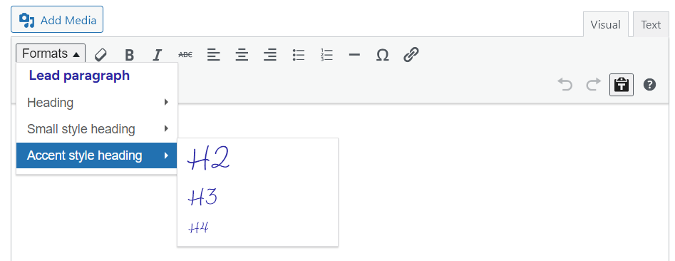
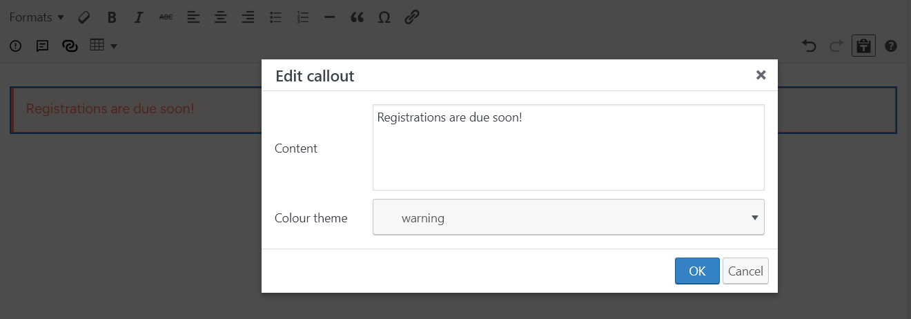
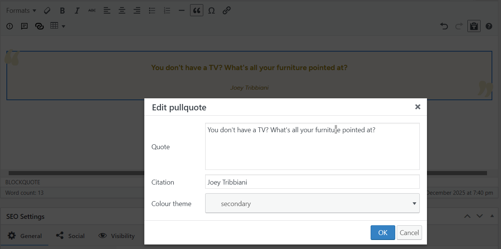
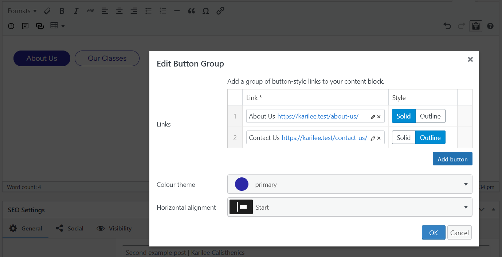
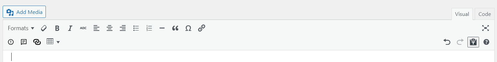
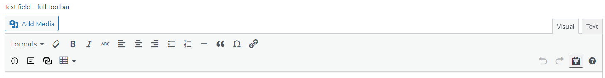
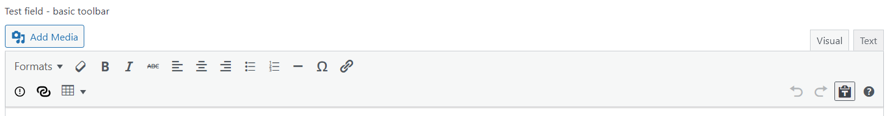
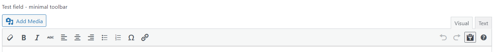

# A WordPress TinyMCE plugin

- [Features](#features)
	- [Format selector](#format-selector)
	- [Miniblocks (callout, pullquote, button group)](#miniblocks)
	- [Tables](#tables)
	- [Default toolbar configurations](#default-toolbar-configurations)
- [Customisation](#customisation)
- [Development](#development)

## Features

> [!NOTE]  
> The plugin does not provide any front-end CSS for any of the features described below, and only very minimal and easily-overridden CSS for the editing interface. It is expected that you will provide your own styling via your theme or plugin.

### Format selector

Replaces the default heading/paragraph menu with a custom format selector that includes additional styles. By default, this also limits the available heading levels to H2 through H4 (it is assumed that the H1 on your page is handled by the template your TinyMCE-driven content appears on), but this can be customised using a filter hook.



### Miniblocks

The name of these comes from their origin as a desire to insert very simple WordPress blocks into TinyMCE content areas, but that not actually being possible. So they aren't actual Gutenberg blocks in any sense of the term, but they are similar to blocks in that they are markup-controlled blocks of content that users can fill in a form to insert or edit.

When the user clicks on an inserted miniblock, a form appears allowing them to edit it using the same UI as when inserting it.

#### Callout
Put a message in a themed box to draw attention to it.



#### Pullquote
Insert a blockquote with a citation.



#### Button group[^1]
Insert a group of themed button-style links. If you are using [Comet Components](https://cometcomponents.io), the buttons will be generated using the `Button` component logic and template (including theme override, if applicable) present at the time of insertion[^2].



[^1]: This miniblock requires [Advanced Custom Fields Pro](https://www.advancedcustomfields.com/pro/) to be installed and active, as it leverages some of its UI components for the editing form. I may look at removing this dependency in future, but I do not have a timeline for it.
[^2]: Because TinyMCE fields store content as plain HTML, if changes are made to the button logic or rendering template they will not be automatically reflected in existing button groups. You would need to edit and re-save each button group to update them.

### Tables

This plugin adds the ability to add and format basic HTML tables. This feature is based on 10up's now-archived [MCE Table Buttons](https://github.com/10up/mce-table-buttons)  plugin, but with the latest (at the time of writing) 4.x version of the TinyMCE tables plugin, reduced in-editor styling options, and additional processing to add BEM class names to some of the table elements.

### Default toolbar configurations

This plugin performs some filtering on the `mce_buttons_*` hooks to customise the toolbars used across instances of TinyMCE in the WordPress admin, including those used by Advanced Custom Fields (ACF) if it is installed and active. It also adds some custom toolbar types for ACF (adding to its existing `Basic` and `Full` toolbars).

<figure style="border:1px solid #CCC; padding:0.5rem">


<figcaption>Standard WP/Classic Editor toolbars</figcaption>
</figure>

<figure style="border:1px solid #CCC; padding:0.5rem">


<figcaption>ACF Full toolbars</figcaption>
</figure>

<figure style="border:1px solid #CCC; padding:0.5rem">


<figcaption>ACF Basic toolbars</figcaption>
</figure>

<figure style="border:1px solid #CCC; padding:0.5rem">


<figcaption>ACF Minimal toolbar</figcaption>
</figure>

---

## Customisation

Plugins and themes can further customise TinyMCE when using this plugin by using the following filters:

| Filter                                  | Parameters        | Usage                                                                                                            |
|-----------------------------------------|-------------------|------------------------------------------------------------------------------------------------------------------|
| `doublee_tinymce_theme_colours`         | array `$colours`  | Set the colour palette for miniblocks that have theme colour pickers, in key (name) and value (hex code) format. |
| `doublee_tinymce_styleselect_formats`   | array `$formats`  | Modify the styles/formats available in the text format dropdown.                                                 |
| `doublee_tinymce_always_remove_buttons` | array `$buttons`  | Modify which buttons are always removed from the toolbars.                                                       |
| `doublee_tinymce_miniblock_defaults`    | array `$defaults` | Modify the default values for miniblock fields, such as setting a default alignment for button groups.           |

### Loading CSS into the editor

WordPress provides a method to load your theme's CSS into TinyMCE editors using the `add_editor_style()` function, for example:

```php
add_action('admin_enqueue_scripts', function() {
	add_editor_style('path/to/your/editor-style.css');
});
```

If you are using ACF, you can also add CSS to its TinyMCE fields like so:
```php
add_filter('tiny_mce_before_init', function($settings
	$settings['content_css'] .= ', ' . esc_url(get_stylesheet_directory_uri() . '/path/to/your/editor-style.css');
	
	return $settings;
});
```

---

## Development

### JavaScript

[Rollup](https://rollupjs.org/) is used to compile the JavaScript files. To install the dependencies and then compile the scripts, run:

```powershell
npm install
```

```powershell
npm run build
```

### PHP

When adding PHP classes, if they are in subdirectories you will need to add them to `composer.json` to use the namespace that ignores directories.

After adding any new class, run:

```powershell
composer dump-autoload -o
```

### CSS

[SASS](https://sass-lang.com/) is used for the admin styling. It is not included as a project dependency as it is assumed you will have it installed globally (if you don't and are a Windows user, I recommend using [Chocolatey](https://community.chocolatey.org/) to install it via CLI).

To compile the CSS, I recommend setting up a file watcher in PhpStorm or the equivalent in other IDEs, but you can also do it via CLI:

```powershell
sass src/editor-ui.scss src/editor-ui.css --watch
```

### Testing

The PHP code has unit tests, written using Pest. To install the dependencies for this, run:

```powershell
composer install
```

Then to run all tests, I recommend using the test runner in PhpStorm, which can also provide in-IDE coverage reporting out of the box. But you can also run all tests via CLI, e.g., for all tests:

```powershell
vendor\bin\pest
```
